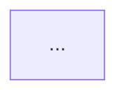

# Flywheel Phase 2 — Decompose into Beads Skill

## Purpose

This skill operationalizes **Phase 2: Task Breakdown** of a Flywheel-style agentic software workflow. It takes the durable plan produced by Phase 1 (`PLAN_FINAL.md`) and converts it into a granular, dependency-aware, self-documenting bead graph that downstream agent swarms can execute.

The skill has exactly four steps:

1. **Spin up the project session** — Create a named tmux session for the project on the VPS so the work is durable, resumable, and observable.
2. **Generate beads** — Inside the tmux session, launch Claude (Opus 4.7 or the latest frontier Anthropic model) and have it elaborate the plan and create the full bead graph using the `br` tool.
3. **Review and revise beads** — Have Claude critically review every bead it just created and revise as needed. Iterate in plan space before implementation begins.
4. **Generate report** — Produce a single human-readable markdown report that walks the user through the beaded workflow, each bead, and the logic behind the breakdown.

This skill is for **bead space**, not implementation space. Do not write production code, scaffold modules, deploy services, or modify application files while this skill is active. The whole point is to operate in plan space — where revisions are cheap — before committing agents to execution.

## Why this protocol exists

A plan and a task graph are not the same thing.

* A plan describes the destination. A bead graph describes the path, the order, and the things that block other things.
* A plan can be subtly under-specified and still feel done. A bead graph forces every fuzzy phrase to become an actual task with a dependency, an acceptance condition, and a rationale.
* Agent swarms execute graphs, not narrative plans. The quality of downstream agent work is upper-bounded by the quality of the bead decomposition.
* Beads are the unit of memory. A well-written bead is a letter to your future self — and to the next agent that picks it up — explaining not just what to do but why, and how it serves the larger project.

Jeffrey Emanuel's framing is the operating principle here: **it's a lot easier and faster to operate in "plan space" before we start implementing these things.** Phase 2 is the last cheap point at which decisions can be reshaped. Once an agent swarm starts executing beads, every revision is more expensive.

The protocol is deliberately simple — four steps, two of them dominated by a single model invocation — because the leverage is in (a) using a frontier model with maximum effort, (b) keeping the canonical prompts intact, and (c) forcing a critical review pass before the graph is locked in.

## When to use this skill

Use this skill when:

* Phase 1 is complete and `PLAN_FINAL.md` exists.
* The user says "run Phase 2," "decompose into beads," "create beads from the plan," or any equivalent.
* The user is ready to transition from plan space to a task graph.
* A previous bead decomposition has gone stale because the plan was substantially revised.

Do not use this skill for:

* Projects without a Phase 1 plan. Run `flywheel-ideation-planning` first.
* Tiny scope (a single bug fix, a one-off script). Beads are overkill for a one-bead project.
* Projects already mid-implementation where the existing bead graph is healthy. Patch the graph; do not rebuild it.
* Direct code implementation. Phase 3 (agent swarm implementation) handles that.

## Prerequisites

Before starting Phase 2, verify:

1. `PLAN_FINAL.md` exists at `.flywheel/phase-1/PLAN_FINAL.md` or has been provided to the agent.
2. The Beads tool (`br`) is installed and working on the VPS. A quick smoke test:

   ```bash
   br --version
   br list --help
   ```

3. `claude` (Claude Code CLI) is installed and authenticated on the VPS.
4. `tmux` is installed on the VPS.
5. The agent has shell access to the VPS (typically via SSH from Hermes).
6. The user has agreed to spend a frontier-model session on the decomposition. This is not a cheap pass.

If any prerequisite is missing, stop and surface it. Do not proceed with degraded inputs — a Phase 2 done on a half-baked plan is worse than no Phase 2 at all, because the resulting bead graph will look authoritative while quietly encoding the plan's gaps.

## Required capabilities

The Hermes harness running this skill must be able to:

1. Open and execute commands inside an SSH session to the VPS.
2. Create and attach to tmux sessions.
3. Invoke the `claude` CLI inside the tmux session.
4. Read and write files in the project workspace (both on the VPS and locally if mirrored).
5. Pass long-form prompt content to the `claude` CLI without truncation or smart-quote substitution.
6. Detach from and reattach to tmux sessions for resumability.

If any capability is unavailable, the skill must surface the limitation rather than silently degrade.

## Model selection

Use **Claude Opus 4.7** by default. If a newer frontier Anthropic model is available at runtime, prefer that one.

```text
Default model:
  claude-opus-4-7

Fallback if Opus 4.7 is unavailable:
  the most capable Anthropic frontier model accessible to the user.

Do not substitute a smaller/faster model.
  Bead decomposition quality compounds across the entire downstream swarm.
  This is exactly the wrong place to economize.
```

Both Step 2 and Step 3 must use `/effort max`. The prompts assume it.

## Artifact directory

At the start of the run, create or reuse this directory on the VPS, inside the project root:

```text
.flywheel/phase-2/
├── 00-session-info.md            tmux session name, started-at, project root, Claude version
├── 01-beads-generation.log       Full transcript of the Step 2 Claude session
├── 02-beads-snapshot-initial.md  `br list` snapshot taken right after Step 2
├── 03-beads-review.log           Full transcript of the Step 3 Claude review session
├── 04-beads-snapshot-final.md    `br list` snapshot taken right after Step 3
├── 05-revisions-summary.md       What changed between the initial and final snapshot
└── REPORT_FINAL.md               Final human-readable report (Step 4 deliverable)
```

The bead graph itself lives inside the Beads database — it is not a markdown artifact. The files above are the audit trail and the human-facing summary. Never claim a file was saved unless it actually was.

## Resumability

At the start of each run, inspect `.flywheel/phase-2/` and the tmux server state:

```text
If the tmux session for this project does not exist:
  resume at Step 1.

If the tmux session exists but 02-beads-snapshot-initial.md is missing:
  resume at Step 2.

If 02-beads-snapshot-initial.md exists but 04-beads-snapshot-final.md is missing:
  resume at Step 3.

If 04-beads-snapshot-final.md exists but REPORT_FINAL.md is missing:
  resume at Step 4.
```

When resuming, say:

```text
Looks like we left off at [step/artifact]. I can continue from there or restart Phase 2. I recommend continuing unless the plan or scope has materially changed since the last run.
```

Do not ask this if the user has already explicitly told you where to resume.

---

# Step 1 — Spin Up the Project Session

## Step 1 goal

Create a named, durable tmux session on the VPS scoped to this project, set up the working directory, confirm the bead system is ready, and record the session metadata. Everything in Steps 2 and 3 runs inside this session so the work survives disconnects, can be reattached, and is observable from outside.

## Choose a session name

Derive a tmux session name from the project. The name must be:

* lowercase,
* alphanumeric plus hyphens (no spaces, slashes, dots, or quotes),
* short enough to type comfortably (≤ 30 chars),
* recognizable from `tmux ls`.

Default convention:

```text
flywheel-<project-slug>-phase2

Examples:
  flywheel-tanzerbot-phase2
  flywheel-ledger-cleanup-phase2
  flywheel-openclaw-mcp-phase2
```

If a session with that name already exists, do not blindly clobber it. Either reattach (resumability path) or pick a `-v2` suffix and surface the choice to the user.

## Procedure

1. SSH or otherwise connect to the VPS as the project user.
2. Confirm the project root contains `.flywheel/phase-1/PLAN_FINAL.md`. If not, stop and surface the missing prerequisite.
3. Create the artifact directory:

   ```bash
   mkdir -p .flywheel/phase-2
   ```

4. Create the tmux session detached, rooted in the project directory:

   ```bash
   tmux new-session -d -s "<session-name>" -c "<project-root>"
   ```

5. Inside the session, verify tooling:

   ```bash
   tmux send-keys -t "<session-name>" "br --version && claude --version && pwd" Enter
   ```

6. Capture session metadata to `00-session-info.md`:

   ```markdown
   # Phase 2 Session Info

   - Project name: <name>
   - Project root: <absolute path>
   - tmux session: <session-name>
   - VPS host: <host>
   - Started at (UTC): <timestamp>
   - Claude CLI version: <version>
   - Beads (`br`) version: <version>
   - Beads database location: <path>
   - Plan source: .flywheel/phase-1/PLAN_FINAL.md
   - Plan SHA-256: <hash for audit>
   ```

7. Echo a short status block to the user:

   ```markdown
   ## Step 1 complete

   - tmux session `<session-name>` is live on the VPS.
   - Tooling verified: `br` and `claude` both responding.
   - `PLAN_FINAL.md` located and hashed.
   - Ready to launch Claude inside the session for Step 2.
   ```

## Step 1 quality gates

Do not proceed to Step 2 unless:

1. The tmux session exists and is attachable.
2. `br` runs and returns a version.
3. `claude` runs and returns a version.
4. The project root contains `PLAN_FINAL.md`.
5. `00-session-info.md` was successfully written.

## Step 1 failure modes

* **tmux session name collision.** Reattach if the prior session is the right one; otherwise pick a versioned name and continue.
* **`br` not installed.** Stop. Direct the user to install Beads. Do not attempt a manual JSON workaround — the whole point is the dependency-aware graph.
* **`claude` not installed or not authenticated.** Stop. Surface the auth state. The user typically resolves this with `claude login` or by checking their Anthropic credentials on the VPS.
* **Plan missing.** Stop. Phase 2 is meaningless without `PLAN_FINAL.md`. Send the user back to `flywheel-ideation-planning`.

---

# Step 2 — Generate Beads

## Step 2 goal

Inside the tmux session created in Step 1, launch Claude (Opus 4.7 or the latest frontier Anthropic model), feed it the final Phase 1 plan, and have it generate the full bead graph by calling the `br` tool repeatedly. The output is not a markdown file of beads — it is real beads in the Beads database.

## The exact prompt

Use the following prompt **exactly as written**. Do not edit, shorten, paraphrase, "improve," normalize, add instructions to, or remove any wording from it. The `/effort max` flag is part of the prompt and must be preserved.

```text
OK so please take ALL of that and elaborate on it more and then create a comprehensive and granular set of beads for all this with tasks, subtasks, and dependency structure overlaid, with detailed comments so that the whole thing is totally self-contained and self-documenting (including relevant background, reasoning/justification, considerations, etc.-- anything we'd want our "future self" to know about the goals and intentions and thought process and how it serves the over-arching goals of the project.) Use the `br` tool repeatedly to create the actual beads. Use /effort max.
```

The "ALL of that" referent in the prompt is the contents of `PLAN_FINAL.md`, which the agent provides as context immediately before the prompt.

## Procedure

1. Attach to or send commands into the tmux session from Step 1.
2. Launch Claude inside the session, requesting Opus 4.7 (or the latest frontier Anthropic model). Example invocation pattern:

   ```bash
   tmux send-keys -t "<session-name>" "claude --model claude-opus-4-7" Enter
   ```

   If `--model` is not the correct flag in the current Claude Code CLI version, use whatever flag the CLI exposes for explicit model selection. Do not let it silently default to a smaller model.

3. As the first message of the Claude session, paste the contents of `.flywheel/phase-1/PLAN_FINAL.md` in full. Wrap it for clarity:

   ```text
   Here is the final Phase 1 plan we've been working on. Please read it in full before I give you the next instruction.

   ===== BEGIN PLAN_FINAL.md =====

   <paste the full plan here>

   ===== END PLAN_FINAL.md =====
   ```

4. After Claude acknowledges, paste the **exact Step 2 prompt** above as the next message. Do not modify it.

5. Let Claude run. It will:

   * elaborate on the plan,
   * decompose it into tasks and subtasks,
   * impose a dependency structure,
   * and call `br` repeatedly to materialize each bead, including rich inline comments with background, reasoning, considerations, and notes-to-future-self.

   Do not interrupt mid-stream. If Claude pauses for clarification, prefer letting it proceed with documented assumptions over redirecting it. The whole point is to capture its full reasoning trace.

6. Capture the entire session transcript to `01-beads-generation.log`. tmux pipe-pane is the cleanest mechanism:

   ```bash
   tmux pipe-pane -t "<session-name>" "cat >> .flywheel/phase-2/01-beads-generation.log"
   ```

   Start piping before launching Claude when possible.

7. When Claude indicates it is finished (or stops calling `br`), snapshot the bead state:

   ```bash
   br list --all > .flywheel/phase-2/02-beads-snapshot-initial.md
   br graph --format=mermaid >> .flywheel/phase-2/02-beads-snapshot-initial.md   # if available
   ```

   If `br graph` is not available, fall back to the most detailed listing the installed `br` version supports (e.g. `br list --verbose`, `br export`, etc.). The goal is a complete, parseable snapshot of every bead that exists at this moment.

## Anti-anchoring discipline

Do not pre-seed Claude with a target bead count, a particular decomposition style, or a phasing scheme. The exact prompt is calibrated to elicit the model's own opinionated breakdown. Adding hints ("aim for 30 beads," "group by component," etc.) reduces the value of the pass. Trust the prompt.

## Step 2 quality gates

Do not proceed to Step 3 unless:

1. Claude actually invoked `br` and beads were created. (`br list` returns more than one bead.)
2. The bead graph has dependency edges, not just a flat list of tasks.
3. Each bead has substantive comments — not stubs like "TBD" or one-line summaries.
4. `01-beads-generation.log` was captured and is non-empty.
5. `02-beads-snapshot-initial.md` was captured.

If any gate fails, do not silently retry — surface the failure to the user. A degraded bead generation is harder to detect after the fact than to catch now.

## Step 2 failure modes

* **Claude refuses or asks for the plan.** It means context was not loaded. Re-paste `PLAN_FINAL.md` and re-issue the exact prompt.
* **Claude generates beads in markdown instead of calling `br`.** Re-emphasize the prompt's `br` requirement by re-pasting the prompt. Do not modify it.
* **Claude stops mid-decomposition (rate limit, context cap, network drop).** The tmux session should preserve the partial state. Resume by asking Claude to continue from the last bead it created. Do not start over from scratch — the partial graph is recoverable.
* **`br` errors during creation.** Capture the error in the log. If the error is structural (e.g. bad dependency reference), let Claude self-correct in-session. If the Beads database itself is corrupted, stop and surface to the user.

---

# Step 3 — Review and Revise Beads

## Step 3 goal

Have Claude — in the same tmux session, with the same model — critically review every bead it just produced, identify weaknesses, and revise as needed. This is the cheap-revision moment. Operating in plan space here saves substantial cost downstream.

## The exact prompt

Use the following prompt **exactly as written**. Do not edit, shorten, paraphrase, "improve," normalize, add instructions to, or remove any wording from it. The `/effort max` flag is part of the prompt and must be preserved.

```text
Check over each bead super carefully-- are you sure it makes sense? Is it optimal? Could we change anything to make the system work better for users? If so, revise the beads. It's a lot easier and faster to operate in "plan space" before we start implementing these things! Use /effort max.
```

## Procedure

1. Stay in the same tmux session and the same Claude session if context permits. Continuity matters — the model's working memory of why it made each choice in Step 2 is valuable for the review.

2. If the Step 2 session was lost or context was reset, start a fresh Claude session inside the same tmux session, paste `02-beads-snapshot-initial.md` as context, then issue the Step 3 prompt.

3. Paste the **exact Step 3 prompt** above. Do not modify it.

4. Let Claude run. It will:

   * read each bead via `br show <id>` (or equivalent),
   * critique it against the original plan and against the rest of the graph,
   * propose revisions,
   * apply revisions via `br edit`, `br depend`, `br comment`, `br split`, `br merge`, or whatever subcommands the installed `br` version exposes,
   * and create new beads if the review surfaces missing work.

5. Continue capturing to a separate review log:

   ```bash
   tmux pipe-pane -t "<session-name>" "cat >> .flywheel/phase-2/03-beads-review.log"
   ```

6. When Claude indicates the review is complete, snapshot the final state:

   ```bash
   br list --all > .flywheel/phase-2/04-beads-snapshot-final.md
   br graph --format=mermaid >> .flywheel/phase-2/04-beads-snapshot-final.md   # if available
   ```

7. Diff the initial and final snapshots to produce `05-revisions-summary.md`:

   ```markdown
   # Phase 2 Bead Revisions Summary

   ## Beads added
   - <id>: <title> — <one-line reason>

   ## Beads modified
   - <id>: <title>
     - Change: <what changed>
     - Why: <reason from review log>

   ## Beads split
   - <old id> → <new ids>: <reason>

   ## Beads merged
   - <old ids> → <new id>: <reason>

   ## Beads removed
   - <id>: <title> — <reason>

   ## Dependency edges added/removed
   - <from> → <to>: added/removed — <reason>

   ## Net counts
   - Beads before review: <N>
   - Beads after review: <M>
   - Edges before review: <E1>
   - Edges after review: <E2>
   ```

   The summary should attribute each change to a justification visible in `03-beads-review.log` so the audit trail is intact.

## Step 3 quality gates

Do not proceed to Step 4 unless:

1. Claude actually inspected the existing beads (via `br show` or equivalent) — visible in the review log.
2. Claude either revised at least one bead with a recorded reason, **or** explicitly stated and justified that the graph was already optimal. A review that says nothing needed changing without saying *why* is not a passing review.
3. `04-beads-snapshot-final.md` was captured.
4. `05-revisions-summary.md` was written.

## Step 3 failure modes

* **Claude rubber-stamps everything.** This is the most dangerous failure because it is silent. If the review log shows no `br show` calls and no critique, re-issue the exact Step 3 prompt and explicitly note that the prior pass appeared to skip the review. Do not modify the prompt's wording — just re-send it.
* **Claude proposes changes but does not apply them.** Ask it to apply the revisions via `br`. Do not paraphrase the original prompt; just nudge.
* **Claude proposes scope-expanding rewrites.** This sometimes happens with `/effort max`. Surface the expansion to the user before letting Claude apply it. Phase 2 is decomposition, not re-planning. If Claude wants to materially change the project's scope, that is a Phase 1 conversation.
* **Diff is enormous.** A massive review-pass diff is a signal that Step 2 was weak, not that Step 3 was strong. Show the user before locking it in.

---

# Step 4 — Generate Report

## Step 4 goal

Produce one human-readable markdown report that lets the user understand the beaded workflow, every bead in it, and the logic behind the breakdown — without having to read either log file or query `br` themselves. This is the final deliverable of Phase 2.

## Procedure

1. Read:

   * `00-session-info.md`,
   * `04-beads-snapshot-final.md`,
   * `05-revisions-summary.md`,
   * `.flywheel/phase-1/PLAN_FINAL.md` (for cross-reference).

2. Walk the bead graph. For each bead, gather:

   * id and title,
   * description,
   * dependencies (incoming and outgoing),
   * inline comments / rationale,
   * which section of `PLAN_FINAL.md` it traces to.

3. Write `REPORT_FINAL.md` using the template below.

## Report template: `REPORT_FINAL.md`

```markdown
# [Project Name] — Phase 2 Bead Decomposition Report

*Generated: [date]. Methodology: Flywheel Phase 2 — elaborate the final plan into a granular, dependency-aware bead graph; review every bead in plan space; produce this report.*

## 1. Executive Summary

- Project: [name]
- Source plan: `.flywheel/phase-1/PLAN_FINAL.md`
- Total beads: [N]
- Total dependency edges: [E]
- Roots (beads with no dependencies): [count]
- Leaves (beads no other bead depends on): [count]
- Longest dependency chain: [depth]
- Model used: [model]
- tmux session: [name]
- Runtime: Step 2 ~[duration], Step 3 ~[duration]

## 2. The Beaded Workflow

### Top-level phases / clusters

[Group beads into the natural clusters Claude produced — typically aligned to the implementation phases in the plan. For each cluster:]

#### Cluster: [name]

- Purpose: [what this cluster accomplishes]
- Beads in cluster: [count]
- Entry points: [bead ids that start this cluster]
- Exit points: [bead ids that close this cluster]
- Critical-path beads: [bead ids on the longest path through the cluster]

### Dependency overview

[Mermaid diagram if `br graph` produced one; otherwise a textual rendering of the high-level structure.]



### Critical path

[List the beads on the longest dependency chain, in order. This is what determines the minimum sequential implementation time even with infinite parallel agents.]

## 3. Bead-by-Bead Walkthrough

[For every bead, in topological order:]

### Bead [id]: [title]

- **Phase / cluster:** [name]
- **Depends on:** [ids or "none"]
- **Blocks:** [ids or "none"]
- **Traces to plan section:** [section of PLAN_FINAL.md]
- **What it does:** [1–3 sentences in the agent's voice]
- **Why it exists / why now:** [the rationale Claude wrote into the bead, summarized]
- **Acceptance signal:** [how we know it's done, if Claude specified]
- **Notes for future self:** [the most important inline comments]
- **Risk / watch-out:** [if Claude flagged any]

[Repeat for every bead. Do not skip beads. The point is that this report is the durable artifact a human can read instead of querying `br` for every bead.]

## 4. The Logic Behind the Breakdown

[Narrative section, not a list. Explain how Claude chose to decompose the work. Specifically:]

- How granular each bead is, and why that granularity was chosen
- How dependencies were inferred (data dependencies, sequencing dependencies, infrastructure-must-exist-first dependencies)
- Where Claude split a single plan section into multiple beads, and why
- Where Claude merged multiple plan elements into one bead, and why
- Where Claude added beads not directly in the plan (infrastructure, scaffolding, tests, evals, docs, etc.) and why each was justified
- Anything in the plan that explicitly did *not* become a bead, and why (e.g., post-MVP, deferred, replaced by a stub)

## 5. What Changed in Review (Step 3)

[Summarize `05-revisions-summary.md` in prose. Highlight the most consequential changes: removed scope traps, added missing prerequisites, tightened acceptance criteria, fixed dependency inversions, etc.]

## 6. Open Questions and Watch-Outs

[Anything Claude flagged during decomposition or review that the user should resolve before agents start executing. Examples:]

- Beads marked as "needs human input"
- Decisions deferred from Phase 1 that surfaced again
- Risky beads that should be sequenced before parallel-safe work begins
- Beads with high blast radius (touch many other beads if changed)

## 7. Recommended Next Phase

Phase 3 (Agent Swarm Implementation) can now begin. Recommended starting beads:

- [ids of root beads or quick-win beads that prove the swarm is healthy]

Recommended human gate before Phase 3:

- Skim Section 3 of this report and approve any bead flagged in Section 6.
- Decide swarm size and which beads to assign first.

## 8. Appendix

- `00-session-info.md` — VPS / tmux / model metadata
- `02-beads-snapshot-initial.md` — bead state right after generation
- `04-beads-snapshot-final.md` — bead state right after review
- `05-revisions-summary.md` — exact diff of the review pass
- `01-beads-generation.log`, `03-beads-review.log` — raw transcripts

To re-render the bead graph at any time:

```bash
br list --all
br graph --format=mermaid     # if available
```
```

## Final response when Phase 2 is complete

Use this structure when reporting completion to the user:

```markdown
Phase 2 is complete.

Produced:
- tmux session: <session-name> (still alive on the VPS)
- `.flywheel/phase-2/00-session-info.md`
- `.flywheel/phase-2/01-beads-generation.log`
- `.flywheel/phase-2/02-beads-snapshot-initial.md`
- `.flywheel/phase-2/03-beads-review.log`
- `.flywheel/phase-2/04-beads-snapshot-final.md`
- `.flywheel/phase-2/05-revisions-summary.md`
- `.flywheel/phase-2/REPORT_FINAL.md`

### Headline numbers
- Total beads: <N>
- Dependency edges: <E>
- Critical path depth: <D>
- Beads added/modified during review: <M>

### Recommended next step
Read `REPORT_FINAL.md`. When you're satisfied with the bead graph, kick off Phase 3 (Agent Swarm Implementation).

Do not start the swarm unless the user explicitly approves.
```

---

# Global quality gates

Phase 2 is complete only when:

* The tmux session was created and survived the run, or was intentionally torn down.
* `01-beads-generation.log` exists and is non-empty.
* `02-beads-snapshot-initial.md` exists and shows a real graph (>1 bead, >0 edges).
* The exact Step 2 prompt was used — no paraphrase, no additions, no substitutions.
* `03-beads-review.log` exists and shows actual review activity (`br show` calls or revision calls), not a rubber stamp.
* `04-beads-snapshot-final.md` exists and is internally consistent (no broken dependency references).
* The exact Step 3 prompt was used.
* `05-revisions-summary.md` exists and traces every change to a justification.
* `REPORT_FINAL.md` exists, covers every bead in the final snapshot, and explains the breakdown logic in prose.
* Open questions surfaced during review are visible to the user, not hidden in logs.

---

# Failure modes and recovery

## Plan changed mid-Phase-2

If `PLAN_FINAL.md` is edited while Phase 2 is running, stop. The bead graph will become incoherent against the moving plan. Either:

```text
Pause Phase 2 and re-run the affected portion of Phase 1, or
Lock the plan version (commit / hash) and finish Phase 2 against that locked version, then re-run Phase 2 once the plan settles.
```

## VPS connection drops

The tmux session preserves state. Reconnect, reattach, and resume from the appropriate step based on the resumability table. Do not restart from Step 1.

## `br` schema mismatch

If the installed `br` version does not support a subcommand the model wants to use (e.g. `br graph`, `br depend`, etc.), let Claude fall back to the available primitives. Capture the workaround in the log so the report can note it.

## Claude switches model mid-session

The Claude Code CLI sometimes routes to a different model under load. If the log shows a non-Opus completion, surface this. The Step 2 and Step 3 prompts both depend on frontier-level reasoning. Re-run with explicit model pinning.

## User wants to skip Step 3

Do not skip Step 3 silently. If the user insists, mark `04-beads-snapshot-final.md` as "review waived" and surface this prominently in `REPORT_FINAL.md`. The downstream agent swarm will execute against an unreviewed graph, and that fact should be visible.

## Bead graph is too granular or too coarse

This is feedback for Step 3. Re-run Step 3 with the *exact* same prompt — do not edit it to nudge granularity. If the model self-corrects, great. If not, it is the user's call whether to live with the current granularity or accept a manual revision pass before Phase 3.

## Bead generation produces zero dependency edges

This is a structural failure of Step 2. A well-decomposed graph almost always has edges. Re-run Step 2 with the exact prompt; do not paraphrase. If the model still produces a flat list, escalate to the user — there is likely something off about how the plan was loaded.

## Report drifts from the bead snapshot

`REPORT_FINAL.md` must match `04-beads-snapshot-final.md`. If the bead database is mutated after the report is written (manual `br` edits, etc.), regenerate the report. The report's value is being a faithful, durable mirror.

---

# Harness implementation notes

## For Hermes (primary target)

* Treat this file as the active procedure for the Phase 2 agent.
* Use Hermes's SSH/VPS tooling to drive tmux on the project VPS.
* Run Steps 2 and 3 inside the tmux session, not in a one-shot SSH command — that way long sessions survive disconnect.
* Pipe Claude session output to the artifact log via `tmux pipe-pane`.
* Do not attempt to manage the bead database from outside the tmux session in parallel; let `br` ownership stay sequential within the session for the duration of the run.
* Persist the tmux session name in Hermes's per-project state so resumability works across user reconnects.

## For OpenClaw / generic skill harnesses

* If the harness has its own VPS abstraction, use that in place of raw SSH.
* If the harness cannot create tmux sessions, document the limitation and proceed with a `nohup` or `screen` equivalent. Surface the substitution in `00-session-info.md`.
* Persist all artifacts under `.flywheel/phase-2/` in the project root.
* Avoid granting code-modification tools to this skill — its scope is the bead graph, not the codebase.

## For Claude Code / Codex / Gemini CLI style workflows

* Run in the project root.
* If you are already running inside a Claude Code session that has shell access to the VPS, you can drive Steps 1, 2, and 3 from your current loop.
* Do not silently substitute a different model. The Step 2 and Step 3 prompts assume frontier-level reasoning and `/effort max`.

## For chat-only workflows

* Phase 2 is awkward but possible without a VPS. Run the bead generation locally instead.
* Provide the user with copy/paste packets for Steps 2 and 3, including the exact prompts.
* Have the user run `br` locally and paste back the snapshots.
* Keep the same artifact structure under `.flywheel/phase-2/`.
* Document the lack of a VPS/tmux session in `00-session-info.md`.

## Installation notes

Hermes-style directory example:

```bash
mkdir -p ~/.hermes/skills/ai-agents/flywheel-decompose-into-beads
cp SKILL.md ~/.hermes/skills/ai-agents/flywheel-decompose-into-beads/SKILL.md
```

OpenClaw-style directory example:

```bash
mkdir -p ~/.openclaw/skills/flywheel-decompose-into-beads
cp SKILL.md ~/.openclaw/skills/flywheel-decompose-into-beads/SKILL.md
```

Workspace-local example:

```bash
mkdir -p ./skills/flywheel-decompose-into-beads
cp SKILL.md ./skills/flywheel-decompose-into-beads/SKILL.md
```

Intended slash commands:

```text
/flywheel-decompose-into-beads
/flywheel-phase-2
```
